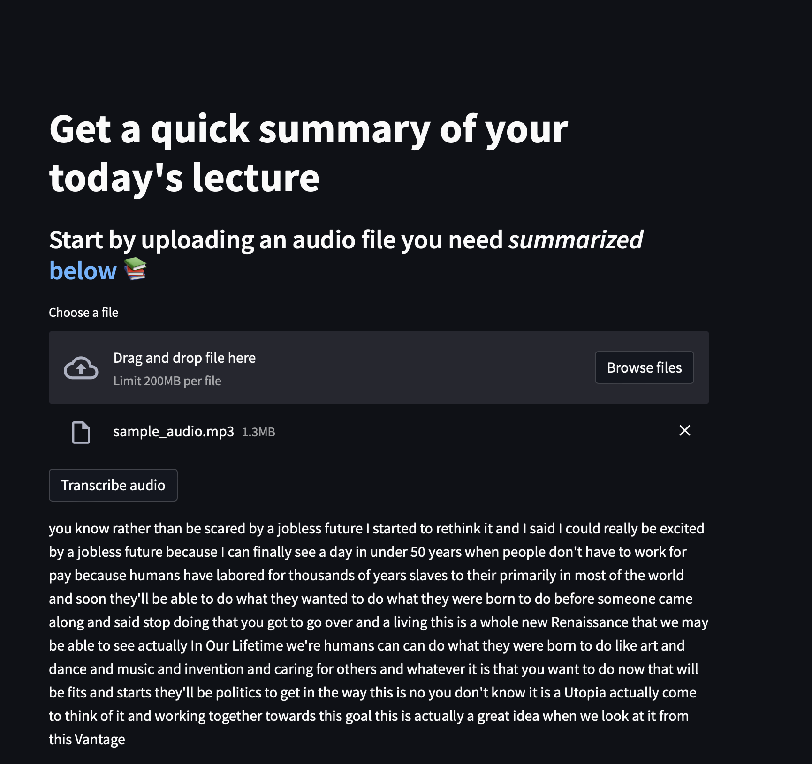

This app is created to summarise long audios, to help people who don't have time to catchup on lecture recordings to understand what they might have missed. 
In the future lecture notes with key points and explainable diagrams will be created to even better the content quality that can be derived from these recordings. 
It would also be useful for those who are too shy to ask question during lectures but also need help in understanding certain parts of the lecture in a simpler and well broken down method , 
most likely better than what the lecturer would have explained. This will be good to implement as part of a university's app for use by the students.

This app runs on python 3.7

